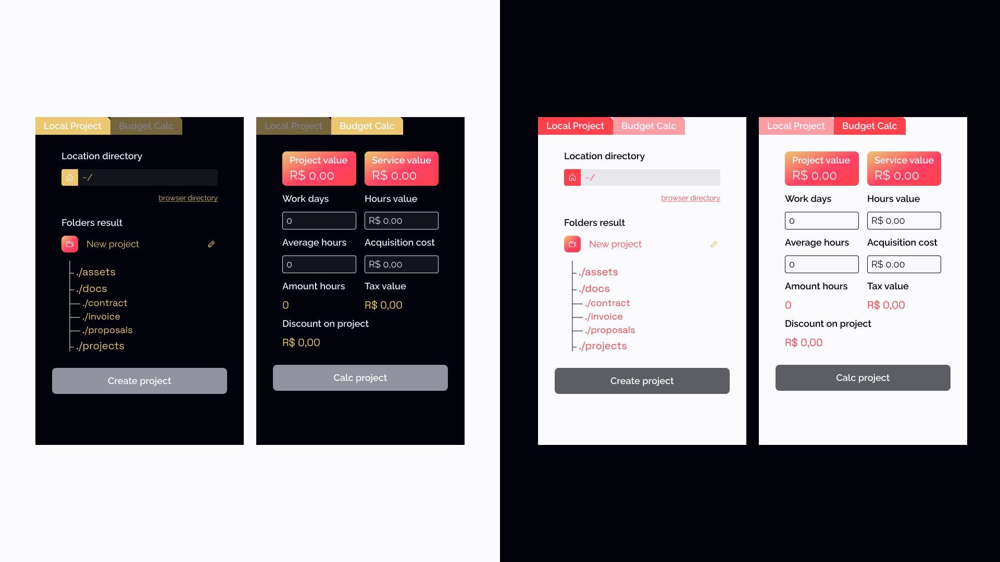

## Install

- Clone:
  ```bash
  https://github.com/afiovinicius/Vicit-Manager.git
  ```
- Install
  ```bash
  yarn install && yarn upgrade
  ```
- Start
  ```bash
  yarn run dev
  ```

## Build

- Linux
  ```bash
  yarn run build-linux
  ```
- Mac
  ```bash
  yarn run build-mac
  ```
- Windows
  ```bash
  yarn run build-win
  ```
